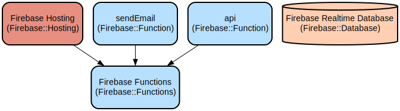

# KREND - Professional Rendering and Plastering Services Web Platform

KREND is a modern web application that showcases professional rendering and plastering services, featuring an interactive gallery, service descriptions, and a contact management system. The platform provides a seamless experience for customers to explore services, view completed projects, and request quotes through an integrated Firebase backend.

The application combines React for the frontend with Firebase for backend services, offering real-time contact form submission handling and secure data storage. It features responsive design principles, ensuring optimal viewing across all devices, and implements modern web development practices including client-side routing and component-based architecture.

## Repository Structure
```
KREND/
├── src/                      # Source code directory
│   ├── App.jsx              # Main application component and routing configuration
│   ├── main.jsx             # Application entry point
│   ├── firebase.js          # Firebase configuration and initialization
│   ├── nav/                 # Navigation components and styles
│   ├── Footer/              # Footer components and styles
│   └── pages/               # Page components organized by feature
│       ├── home/            # Home page components and styles
│       ├── services/        # Services page components and styles
│       ├── gallery/         # Gallery page with carousel implementation
│       ├── contact/         # Contact form with Firebase integration
│       └── whoweare/        # Company information page
├── functions/               # Firebase Cloud Functions
│   ├── index.js            # Cloud function implementations
│   └── package.json        # Cloud functions dependencies
├── server.js               # Production server implementation
├── serverLOCAL.js         # Development server implementation
├── firebase.json          # Firebase configuration and hosting rules
└── vite.config.js         # Vite build and development configuration
```

## Usage Instructions
### Prerequisites
- Node.js (v14.0.0 or higher)
- npm (v6.0.0 or higher)
- Firebase account and project setup
- Firebase CLI installed globally (`npm install -g firebase-tools`)

### Installation

1. Clone the repository:
```bash
git clone <repository-url>
cd KREND
```

2. Install dependencies:
```bash
npm install
cd functions && npm install && cd ..
```

3. Set up environment variables:
Create a `.env` file in the root directory with the following variables:
```
EMAIL_USER=EMAILHANDLER@GMAIL.COM
EMAIL_PASSWORD=APPPASSWORD
RECIPIENT_EMAIL=FORMRECIEVER@EXAMPLE.COM
PORT=PORT_RUNNING_ON

VITE_FIREBASE_API_KEY=your_api_key
VITE_FIREBASE_AUTH_DOMAIN=your_auth_domain
VITE_FIREBASE_DATABASE_URL=your_database_url
VITE_FIREBASE_PROJECT_ID=your_project_id
VITE_FIREBASE_STORAGE_BUCKET=your_storage_bucket
VITE_FIREBASE_MESSAGING_SENDER_ID=your_messaging_sender_id
VITE_FIREBASE_APP_ID=your_app_id
```

### Quick Start
1. Start the development server:
```bash
npm run dev
```

2. In a separate terminal, start the local API server:
```bash
npm run server
```

The application will be available at `http://localhost:5173`

### More Detailed Examples

1. Submitting a Contact Form:
```javascript
// Navigate to /contact
// Fill out the form with required fields
const formData = {
  name: "John Doe",
  email: "john@example.com",
  phone: "1234567890",
  service: "K-Rendering",
  message: "I need a quote for my house"
};
// Submit the form
```

2. Viewing the Gallery:
```javascript
// Navigate to /gallery
// Use arrow buttons or wait for auto-rotation
// Click on images to view details
```

### Troubleshooting

1. Contact Form Submission Errors
- Issue: Form submission fails
- Solution: 
  ```bash
  # Check Firebase connection
  firebase login
  firebase functions:log
  ```

2. Image Loading Issues in Gallery
- Issue: Images not loading in carousel
- Solution: Check browser console for path errors and ensure images are in the correct directory

## Data Flow
The application follows a unidirectional data flow pattern, with Firebase Realtime Database as the central data store.

```ascii
User Input -> React Components -> Firebase Functions -> Database
     ^                                                    |
     |                                                    v
Client Rendering <- React State Management <- Real-time Updates
```

Component interactions:
1. User interactions trigger React component state updates
2. Form submissions are processed through Firebase Functions
3. Real-time database updates trigger UI refreshes
4. Gallery images are loaded dynamically using Vite's import.meta.glob
5. Navigation handled through React Router
6. Contact form data is validated client-side before submission
7. Error handling is implemented at both client and server levels

## Infrastructure



Firebase Resources:
- Hosting:
  - Public directory: "dist"
  - Custom rewrite rules for API endpoints
- Functions:
  - sendEmail: Handles email sending functionality
  - api: General-purpose API endpoint
- Database:
  - Realtime Database for contact form submissions